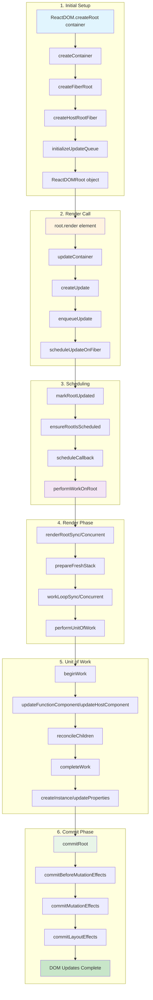

# 🔄 Step 3: Complete Execution Flow - React 19

## 🎯 Overview

This step traces the **complete execution path** from `ReactDOM.createRoot()` to DOM updates in React 19. You'll follow every major function call and understand how React transforms your JSX into real DOM changes.

## 📊 Complete Flow Diagram



## 🔍 Detailed Flow Analysis

### Phase 1: createRoot() - Setting Up the Foundation

#### 📍 Entry Point: `ReactDOM.createRoot(container)`
**File**: `packages/react-dom/src/client/ReactDOMClient.js`

```javascript
// 1. Entry point
export function createRoot(container, options) {
  // Validation and options processing
  return new ReactDOMRoot(
    createContainer(container, ConcurrentRoot, options)
  );
}
```

#### 🔧 Key Function Chain:

1. **`createContainer()`** → `packages/react-reconciler/src/ReactFiberReconciler.js#L247`
2. **`createFiberRoot()`** → `packages/react-reconciler/src/ReactFiberRoot.js#L134`
3. **`createHostRootFiber()`** → `packages/react-reconciler/src/ReactFiber.js#L428`
4. **`initializeUpdateQueue()`** → `packages/react-reconciler/src/ReactFiberClassUpdateQueue.js#L184`

#### 🏗️ What Gets Created:

```javascript
// FiberRootNode structure
{
  tag: ConcurrentRoot,           // Root type (1 for concurrent)
  containerInfo: domElement,     // Your DOM container
  current: hostRootFiber,        // Points to root fiber
  pendingLanes: NoLanes,         // Priority lanes
  callbackNode: null,            // Scheduler callback
  // ... 25+ more properties
}

// HostRoot Fiber structure  
{
  tag: HostRoot,                 // Fiber type (3)
  stateNode: fiberRootNode,      // Points back to FiberRoot
  updateQueue: {                 // Update queue
    baseState: null,
    firstBaseUpdate: null,
    lastBaseUpdate: null,
    shared: { pending: null }
  }
  // ... 25+ more properties
}
```

### Phase 2: root.render() - Triggering the Update

#### 📍 Entry Point: `root.render(<App />)`
**File**: `packages/react-dom/src/client/ReactDOMClient.js#L92`

```javascript
// ReactDOMRoot.prototype.render
render(children) {
  const root = this._internalRoot;
  updateContainer(children, root, null, null);
}
```

#### 🔧 Key Function Chain:

1. **`updateContainer()`** → `packages/react-reconciler/src/ReactFiberReconciler.js#L321`
2. **`createUpdate()`** → `packages/react-reconciler/src/ReactFiberClassUpdateQueue.js#L202`
3. **`enqueueUpdate()`** → `packages/react-reconciler/src/ReactFiberClassUpdateQueue.js#L216`
4. **`scheduleUpdateOnFiber()`** → `packages/react-reconciler/src/ReactFiberWorkLoop.js#L528`

#### 📦 Update Object Created:

```javascript
// Update structure
{
  eventTime: currentTime,        // When update was created
  lane: SyncLane,               // Priority lane
  tag: UpdateState,             // Update type
  payload: { element: <App /> }, // Your React element
  callback: null,               // Optional callback
  next: null                    // Next update in queue
}
```

### Phase 3: Scheduling - Deciding When to Work

#### 📍 Core Function: `scheduleUpdateOnFiber()`
**File**: `packages/react-reconciler/src/ReactFiberWorkLoop.js#L528`

```javascript
function scheduleUpdateOnFiber(root, fiber, lane) {
  // 1. Mark root as having work
  markRootUpdated(root, lane);
  
  // 2. Schedule the work
  ensureRootIsScheduled(root);
  
  // 3. For sync updates, flush immediately
  if (lane === SyncLane) {
    flushSyncWork();
  }
}
```

#### 🔧 Key Function Chain:

1. **`markRootUpdated()`** → Updates root's pending lanes
2. **`ensureRootIsScheduled()`** → `packages/react-reconciler/src/ReactFiberWorkLoop.js#L785`
3. **`scheduleCallback()`** → `packages/scheduler/src/Scheduler.js#L279`
4. **`performWorkOnRoot()`** → The actual work function

### Phase 4: Render Phase - Building the New Tree

#### 📍 Core Function: `performWorkOnRoot()`
**File**: `packages/react-reconciler/src/ReactFiberWorkLoop.js#L1045`

```javascript
function performWorkOnRoot(root, lanes) {
  // Choose sync or concurrent rendering
  if (includesSyncLane(lanes)) {
    renderRootSync(root, lanes);
  } else {
    renderRootConcurrent(root, lanes);
  }
  
  // Commit the result
  const finishedWork = root.finishedWork;
  if (finishedWork !== null) {
    commitRoot(root, finishedWork);
  }
}
```

#### 🔧 Key Function Chain:

1. **`renderRootSync()`** → `packages/react-reconciler/src/ReactFiberWorkLoop.js#L1329`
2. **`prepareFreshStack()`** → Sets up work-in-progress tree
3. **`workLoopSync()`** → `packages/react-reconciler/src/ReactFiberWorkLoop.js#L1606`
4. **`performUnitOfWork()`** → `packages/react-reconciler/src/ReactFiberWorkLoop.js#L1637`

#### 🔄 Work Loop Pattern:

```javascript
function workLoopSync() {
  while (workInProgress !== null) {
    performUnitOfWork(workInProgress);
  }
}

function performUnitOfWork(unitOfWork) {
  const next = beginWork(unitOfWork);
  
  if (next === null) {
    completeUnitOfWork(unitOfWork);
  } else {
    workInProgress = next;
  }
}
```

### Phase 5: Component Processing - The Heart of React

#### 📍 Core Function: `beginWork()`
**File**: `packages/react-reconciler/src/ReactFiberBeginWork.js#L4109`

```javascript
function beginWork(current, workInProgress, renderLanes) {
  switch (workInProgress.tag) {
    case FunctionComponent:
      return updateFunctionComponent(current, workInProgress, renderLanes);
    case ClassComponent:
      return updateClassComponent(current, workInProgress, renderLanes);
    case HostComponent:
      return updateHostComponent(current, workInProgress, renderLanes);
    case HostRoot:
      return updateHostRoot(current, workInProgress, renderLanes);
    // ... more cases
  }
}
```

#### 🎯 For Our Demo App:

1. **HostRoot** → Processes the root update
2. **ClassComponent** → Processes `<App />` class component
3. **FunctionComponent** → Processes `<Counter />` function component
4. **HostComponent** → Processes `<div>`, `<button>` DOM elements

#### 🔧 Component Processing Chain:

```javascript
// For <App /> (ClassComponent)
updateClassComponent() →
  constructClassInstance() →     // Create component instance
  mountClassInstance() →         // Set up state and lifecycle
  finishClassComponent() →       // Call render()
  reconcileChildren()           // Process children

// For <Counter /> (FunctionComponent)  
updateFunctionComponent() →
  renderWithHooks() →           // Set up hooks dispatcher
  Component() →                 // Call your function
  reconcileChildren()          // Process children

// For <div>, <button> (HostComponent)
updateHostComponent() →
  reconcileChildren()          // Process text/children
```

### Phase 6: Reconciliation - The Diff Algorithm

#### 📍 Core Function: `reconcileChildren()`
**File**: `packages/react-reconciler/src/ReactChildFiber.js#L1755`

```javascript
function reconcileChildren(current, workInProgress, nextChildren, renderLanes) {
  if (current === null) {
    // Mount: create new fibers
    workInProgress.child = mountChildFibers(
      workInProgress, null, nextChildren, renderLanes
    );
  } else {
    // Update: reconcile existing fibers
    workInProgress.child = reconcileChildFibers(
      workInProgress, current.child, nextChildren, renderLanes
    );
  }
}
```

#### 🔧 Key Reconciliation Functions:

1. **`reconcileSingleElement()`** → For single React elements
2. **`reconcileChildrenArray()`** → For arrays of children
3. **`createFiberFromElement()`** → Creates new fiber nodes
4. **`useFiber()`** → Reuses existing fiber nodes

### Phase 7: Completion - Preparing for Commit

#### 📍 Core Function: `completeWork()`
**File**: `packages/react-reconciler/src/ReactFiberCompleteWork.js#L1064`

```javascript
function completeWork(current, workInProgress, renderLanes) {
  switch (workInProgress.tag) {
    case HostComponent:
      // Create or update DOM instance
      const instance = createInstance(workInProgress.type, workInProgress.pendingProps);
      appendAllChildren(instance, workInProgress);
      workInProgress.stateNode = instance;
      break;
    
    case FunctionComponent:
    case ClassComponent:
      // Bubble up effects
      bubbleProperties(workInProgress);
      break;
  }
}
```

#### 🏗️ What Happens:

1. **DOM Creation**: `createInstance()` creates actual DOM nodes
2. **Property Setting**: `finalizeInitialChildren()` sets DOM properties
3. **Effect Bubbling**: `bubbleProperties()` bubbles up side effects
4. **Tree Assembly**: Children are attached to parents

### Phase 8: Commit Phase - Applying Changes

#### 📍 Core Function: `commitRoot()`
**File**: `packages/react-reconciler/src/ReactFiberWorkLoop.js#L2465`

```javascript
function commitRoot(root, finishedWork) {
  // Three sub-phases
  commitBeforeMutationEffects(root, finishedWork);
  commitMutationEffects(root, finishedWork);
  commitLayoutEffects(root, finishedWork);
}
```

#### 🔧 Commit Sub-Phases:

1. **Before Mutation** → `getSnapshotBeforeUpdate()`, async effects scheduling
2. **Mutation** → DOM insertions, updates, deletions
3. **Layout** → `componentDidMount()`, `useLayoutEffect()`, ref updates

#### 📍 DOM Updates: `commitMutationEffects()`
**File**: `packages/react-reconciler/src/ReactFiberCommitWork.js#L2108`

```javascript
function commitMutationEffects(root, finishedWork) {
  recursivelyTraverseMutationEffects(root, finishedWork);
  commitReconciliationEffects(finishedWork);
}

// Key operations:
// - Placement: appendChild(), insertBefore()
// - Update: updateProperties()
// - Deletion: removeChild()
```

## 🔬 Real Example Trace

Let's trace our demo app through the complete flow:

### Input: 
```javascript
const root = ReactDOM.createRoot(document.getElementById("root"));
root.render(<App />);
```

### Execution Trace:

1. **createRoot** creates FiberRoot + HostRoot fiber
2. **render** creates update with `payload: { element: <App /> }`
3. **scheduleUpdateOnFiber** marks root as needing work
4. **performWorkOnRoot** starts the render phase
5. **beginWork** on HostRoot processes the update
6. **beginWork** on ClassComponent calls `App.render()`
7. **reconcileChildren** creates fibers for `<div>` and `<Counter />`
8. **beginWork** on FunctionComponent calls `Counter()` 
9. **useState** hook sets up state and dispatcher
10. **reconcileChildren** creates fiber for `<button>`
11. **completeWork** creates DOM instances bottom-up
12. **commitRoot** applies all changes to DOM

## 🛠️ Debug Breakpoints

Add these breakpoints to observe the flow:

```javascript
// In browser console or your code:

// 1. Root creation
ReactDOM.createRoot = new Proxy(ReactDOM.createRoot, {
  apply(target, thisArg, args) {
    debugger; // Breakpoint 1: createRoot entry
    return target.apply(thisArg, args);
  }
});

// 2. Render call
root.render = new Proxy(root.render, {
  apply(target, thisArg, args) {
    debugger; // Breakpoint 2: render entry  
    return target.apply(thisArg, args);
  }
});

// 3. Component execution
const originalUseState = React.useState;
React.useState = function(...args) {
  debugger; // Breakpoint 3: useState call
  return originalUseState.apply(this, args);
};
```

## 🎯 Key Insights

### 1. **Two-Phase Rendering**
- **Render Phase**: Build fiber tree (can be interrupted)
- **Commit Phase**: Apply changes to DOM (synchronous)

### 2. **Fiber Architecture Benefits**
- **Incremental**: Work can be split into units
- **Interruptible**: High-priority updates can interrupt low-priority ones
- **Reusable**: Fibers can be reused across renders

### 3. **Priority System (React 19)**
- **SyncLane**: Immediate updates (user input)
- **DefaultLane**: Normal updates (setState)
- **TransitionLane**: Background updates (transitions)

### 4. **Hook Magic**
- Hooks are stored as linked list on fiber's `memoizedState`
- Hook dispatcher changes based on mount vs update
- Hook order must be consistent (hence the rules)

## 🚀 Next Steps

Now that you understand the complete flow:

1. **Step 4**: Deep dive into the Fiber work loop
2. **Step 5**: Understand component mounting in detail
3. **Step 6**: Master the hook system implementation

## 📚 Source Code References

- [ReactDOMClient.js](../packages/react-dom/src/client/ReactDOMClient.js) - createRoot entry point
- [ReactFiberWorkLoop.js](../packages/react-reconciler/src/ReactFiberWorkLoop.js) - Main work loop
- [ReactFiberBeginWork.js](../packages/react-reconciler/src/ReactFiberBeginWork.js) - Component processing
- [ReactFiberCommitWork.js](../packages/react-reconciler/src/ReactFiberCommitWork.js) - DOM commit phase
- [ReactFiberHooks.js](../packages/react-reconciler/src/ReactFiberHooks.js) - Hook implementation

**Congratulations!** 🎉 You now understand React's complete execution flow from createRoot to DOM updates. This foundation will make all subsequent learning much easier. 