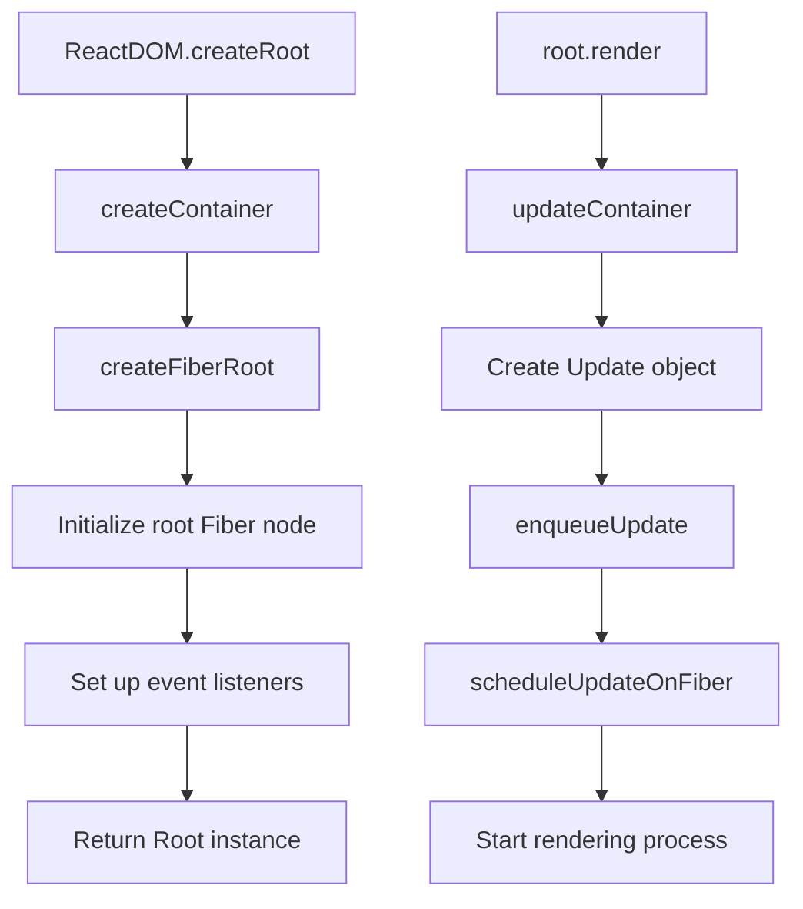
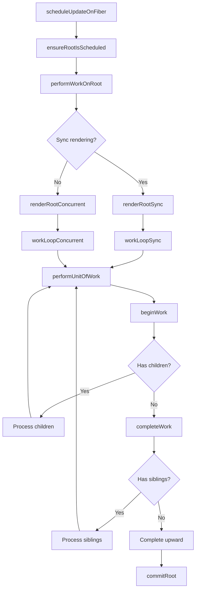
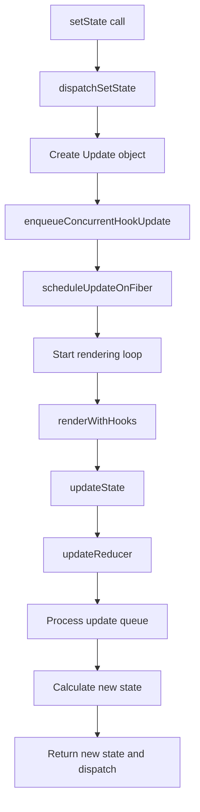

# React Architecture Overview

> A bird's-eye view of React source code analysis - Understanding overall architecture and core working principles

## Table of Contents

- [Overall Architecture](#overall-architecture)
- [Core Package Structure](#core-package-structure)
- [Key Processes](#key-processes)
- [Core Concepts](#core-concepts)
- [Rendering Pipeline](#rendering-pipeline)
- [State Management Mechanism](#state-management-mechanism)

## Overall Architecture

React adopts a **layered architecture** and **monorepo** design, mainly divided into the following layers:

```
┌─────────────────────────────────────────────┐
│                Application Layer              │
│         (User-written React components)       │
├─────────────────────────────────────────────┤
│              React Core API Layer            │
│    (createElement, Component, Hooks)         │
├─────────────────────────────────────────────┤
│             Reconciler Layer                 │
│   (Fiber architecture, Scheduler, Update Queue) │
├─────────────────────────────────────────────┤
│              Renderer Layer                  │
│     (react-dom, react-native, etc.)         │
├─────────────────────────────────────────────┤
│               Platform Layer                 │
│        (DOM, Native platforms, Other targets) │
└─────────────────────────────────────────────┘
```

## Core Package Structure

### 1. React Core Packages

| Package | Function | Key Files |
|-----|------|---------|
| `react` | Core API and Hooks | `ReactHooks.js`, `ReactElement.js` |
| `react-dom` | DOM renderer | `ReactDOMRoot.js`, `ReactDOMClient.js` |
| `react-reconciler` | Fiber reconciler | `ReactFiberWorkLoop.js`, `ReactFiberHooks.js` |
| `scheduler` | Time-slicing scheduler | `Scheduler.js` |

### 2. Supporting Packages

| Package | Function |
|-----|------|
| `react-devtools` | Developer tools |
| `compiler` | React compiler |
| `shared` | Shared utilities and constants |

## Key Processes

### 1. Application Startup Flow



### 2. Rendering Loop Flow



### 3. useState Update Flow



## Core Concepts

### 1. Fiber Architecture

**Fiber is React's core data structure**, representing a unit of work:

```javascript
type Fiber = {
  // Identity information
  tag: WorkTag,                 // Component type
  key: null | string,           // React key
  elementType: any,             // Element type
  type: any,                    // Specific component or DOM node type
  
  // Relationship pointers
  return: Fiber | null,         // Parent node
  child: Fiber | null,          // First child node
  sibling: Fiber | null,        // Next sibling node
  
  // State information
  pendingProps: any,            // New props
  memoizedProps: any,           // Current props
  memoizedState: any,           // Current state
  updateQueue: mixed,           // Update queue
  
  // Side effects
  flags: Flags,                 // Side effect flags
  subtreeFlags: Flags,          // Subtree side effect flags
  
  // Double buffering
  alternate: Fiber | null,      // Corresponding alternate Fiber node
}
```

### 2. Double Buffering Architecture

React uses **double buffering technique** to achieve flicker-free updates:

```
Current Tree (currently displayed)     WorkInProgress Tree (being built)
      HostRoot  ←----------→  HostRoot
         |                      |
       App                    App (updated)
      /   \                  /   \
   Comp1  Comp2           Comp1  Comp2 (new)
```

### 3. Hook Mechanism

Hooks are **linked list structures**, stored in the Fiber node's `memoizedState`:

```javascript
type Hook = {
  memoizedState: any,      // Current state value
  baseState: any,          // Base state
  baseQueue: Update<any, any> | null,  // Base update queue
  queue: any,              // Current update queue
  next: Hook | null,       // Next Hook
}
```

### 4. Priority System

React's **Lane model** is used for priority scheduling:

```javascript
// Priority from high to low
SyncLane = 0b0000000000000000000000000000001;     // Sync priority
InputContinuousLane = 0b0000000000000000000000000000100;  // Continuous input
DefaultLane = 0b0000000000000000000000000010000;          // Default priority
TransitionLane = 0b0000000000000000000001000000000;       // Transition priority
IdleLane = 0b0010000000000000000000000000000;             // Idle priority
```

## Rendering Pipeline

### 1. Render Phase (Interruptible)

- **Goal**: Build new Fiber tree
- **Main work**:
  - Call component functions/class methods
  - Execute Hooks
  - Calculate new state and props
  - Compare old and new virtual DOM

### 2. Commit Phase (Non-interruptible)

- **Goal**: Apply changes to real DOM
- **Three sub-phases**:
  - **Before Mutation**: Execute `getSnapshotBeforeUpdate`
  - **Mutation**: Manipulate DOM
  - **Layout**: Execute `componentDidMount`, `useLayoutEffect`

### 3. Passive Phase (Asynchronous)

- **Goal**: Execute side effects
- **Main work**: Execute `useEffect` callbacks

## State Management Mechanism

### 1. Update Queue

Each Fiber node has an update queue:

```javascript
type UpdateQueue<State, Action> = {
  pending: Update<State, Action> | null,      // Pending updates
  lanes: Lanes,                               // Update priority
  dispatch: (Action) => void,                 // Dispatch function
  lastRenderedReducer: (State, Action) => State,  // Last rendered reducer
  lastRenderedState: State,                   // Last rendered state
}
```

### 2. Batched Updates

React **automatically batches** multiple state updates:

```javascript
// These two setState calls will be batched together
setCount(count + 1);
setName('new name');
```

### 3. Concurrent Features

- **Time Slicing**: Long tasks are divided into small chunks
- **Priority Scheduling**: High priority tasks can interrupt low priority tasks
- **Suspense**: Declarative async loading

## Key API Flows

### ReactDOM.createRoot()

1. Create FiberRoot and root Fiber node
2. Initialize update queue
3. Set up event delegation
4. Return Root instance

### root.render()

1. Create Update object
2. Add Update to queue
3. Schedule update task
4. Start rendering loop

### useState()

1. **Initial mount**: Create Hook object, initialize state
2. **Updates**: Read from Hook linked list, calculate new state
3. **setState call**: Create Update, trigger re-render

## Debugging Suggestions

### 1. Use React DevTools

- **Profiler**: Analyze rendering performance
- **Components**: View component tree and state
- **Settings**: Enable Fiber debugging

### 2. Key Breakpoint Locations

- `packages/react-reconciler/src/ReactFiberWorkLoop.js:performUnitOfWork`
- `packages/react-reconciler/src/ReactFiberHooks.js:dispatchSetState`
- `packages/react-reconciler/src/ReactFiberBeginWork.js:beginWork`

### 3. Logging Techniques

```javascript
// Add debugging info in components
function MyComponent() {
  console.log('MyComponent rendering');
  const [state, setState] = useState(0);
  
  useEffect(() => {
    console.log('MyComponent effect');
  });
  
  return <div onClick={() => setState(s => s + 1)}>{state}</div>;
}
```

## Learning Path Recommendations

1. **Understand basic concepts**: Fiber, Hook, Priority
2. **Trace key flows**: Create root node → Initial render → State update
3. **Deep dive into core modules**: reconciler, scheduler, event system
4. **Master debugging techniques**: DevTools, breakpoint debugging, performance analysis

---

This overview provides a roadmap for deep learning of React source code. It's recommended to start with the process you're most interested in and combine it with actual code debugging to deepen understanding. 