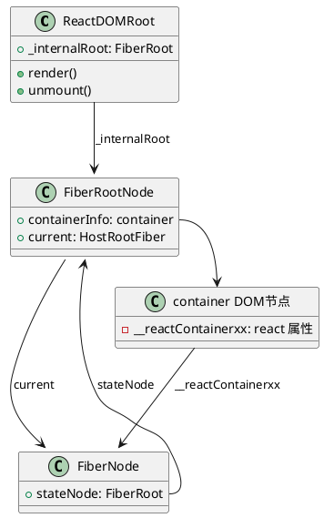

# react 源码分析

## 目标

1. 了解 createRoot 流程 done
2. render 流程 working
   1. workInProgress 是在哪个阶段创建和推送的 done
   2. processUpdateQueue 是如何处理的
3. Fiber 架构的核心对象和功能
4. 了解生命周期钩子是如何触发的？
5. 事件代理原理
6. 更新的流程是怎样的？
7. 如何做差异比对的？

## 核心包

1. **scheduler** 调度器实现在每帧内执行，避免同步渲染的阻塞问题
2. **react-reconciler** 完成 Fiber 树的构建和更新

## 核心对象

### Fiber

1. Fiber 对象，包含如下功能，详细属性如下
   -  引用 Element 树结构
   -  作为渲染的基本单位
   -  作为调度的基本单位
   -  RootFiber 为 UI 树

```js
export type Fiber = {
   tag: WorkTag, // 标识 Fiber 的类型，例如函数组件、类组件、宿主组件等。
   key: null | string, // 唯一标识子节点的键值，用于在调和过程中保持子节点的稳定性。
   elementType: any, // 元素的类型，用于在调和过程中保持组件的身份。
   type: any, // 解析后的函数/类/对象，表示与该 Fiber 关联的组件。
   stateNode: any, // 与该 Fiber 关联的本地状态节点，例如 DOM 节点或类组件实例。
   return: Fiber | null, // 指向父 Fiber 节点。
   child: Fiber | null, // 指向第一个子 Fiber 节点。
   sibling: Fiber | null, // 指向下一个兄弟 Fiber 节点。
   index: number, // 子节点的索引。
   ref:
      | null
      | (((handle: mixed) => void) & { _stringRef: ?string, ... })
      | RefObject, // 引用，用于访问 DOM 节点或组件实例。
   refCleanup: null | (() => void), // 清理引用的函数。
   pendingProps: any, // 当前渲染周期的输入属性。
   memoizedProps: any, // 上一次渲染周期的输入属性。该属性会包含 Element 属性的传入内容，内部的 children 会包含 Element 的子节点信息
   updateQueue: mixed, // 状态更新队列。
   memoizedState: any, // 上一次渲染周期的状态。
   dependencies: Dependencies | null, // 依赖项（上下文、事件等）。
   mode: TypeOfMode, // 描述 Fiber 及其子树的属性的位字段。
   flags: Flags, // 描述 Fiber 及其子树的副作用的位字段。
   subtreeFlags: Flags, // 子树的副作用位字段。
   deletions: Array<Fiber> | null, // 要删除的 Fiber 节点数组。
   lanes: Lanes, // 当前 Fiber 的优先级。 https://github.com/facebook/react/pull/18796
   childLanes: Lanes, // 子树的优先级。
   alternate: Fiber | null, // 备用 Fiber，用于双缓冲机制。
   actualDuration?: number, // 当前更新中渲染该 Fiber 及其子树所花费的时间。
   actualStartTime?: number, // 当前更新中开始渲染该 Fiber 的时间。
   selfBaseDuration?: number, // 最近一次渲染该 Fiber 所花费的时间。
   treeBaseDuration?: number, // 子树的基础时间总和。
   _debugInfo?: ReactDebugInfo | null, // 调试信息。
   _debugOwner?: ReactComponentInfo | Fiber | null, // 调试所有者。
   _debugStack?: string | Error | null, // 调试堆栈。
   _debugTask?: ConsoleTask | null, // 调试任务。
   _debugIsCurrentlyTiming?: boolean, // 是否正在计时。
   _debugNeedsRemount?: boolean, // 是否需要重新挂载。
   _debugHookTypes?: Array<HookType> | null, // 用于验证钩子顺序的类型数组。
};
```

2. Element 对象


3. Update 对象

```js
export type Update<State> = {
  lane: Lane, // 优先级
   // 0 (UpdateState): 普通的状态更新（如调用 setState）。
   // 1 (ReplaceState): 替换当前的状态。
   // 2 (ForceUpdate): 强制组件重新渲染。
   // 3 (CaptureUpdate): 用于错误边界，捕获错误相关的更新。
  tag: 0 | 1 | 2 | 3, // 标识更新的类型
  payload: any, // 存储与更新相关的数据，可能是新状态的对象或一个返回新状态的函数。
  callback: (() => mixed) | null, // 在更新完成后执行的回调函数。
  next: Update<State> | null, // 指向下一个更新，形成链表结构。
};
```

## 代码核心断点

1. 工具函数处理 tag, mode, flags, lanes 等属性对应的含义

```js
const TagMap = {
   0: "FunctionComponent",
   1: "ClassComponent",
   3: "HostRoot", // Root of a host tree. Could be nested inside another node.
   4: "HostPortal", // A subtree. Could be an entry point to a different renderer.
   5: "HostComponent",
   6: "HostText",
   7: "Fragment",
   8: "Mode",
   9: "ContextConsumer",
   10: "ContextProvider",
   11: "ForwardRef",
   12: "Profiler",
   13: "SuspenseComponent",
   14: "MemoComponent",
   15: "SimpleMemoComponent",
   16: "LazyComponent",
   17: "IncompleteClassComponent",
   18: "DehydratedFragment",
   19: "SuspenseListComponent",
   21: "ScopeComponent",
   22: "OffscreenComponent",
   23: "LegacyHiddenComponent",
   24: "CacheComponent",
   25: "TracingMarkerComponent",
   26: "HostHoistable",
   27: "HostSingleton",
   28: "IncompleteFunctionComponent",
   29: "Throw",
};

const ModeMap = {
   0b0000000: "NoMode",
   0b0000001: "ConcurrentMode",
   0b0000010: "ProfileMode",
   0b0000100: "DebugTracingMode",
   0b0001000: "StrictLegacyMode",
   0b0010000: "StrictEffectsMode",
   0b1000000: "NoStrictPassiveEffectsMode",
};
let getModeAsString = (modes) => {
   if (modes === 0) return "NoMode";

   const setModes = [];
   for (const [binStr, modeName] of Object.entries(ModeMap)) {
      const binNum = +binStr;
      if (modes & binNum) {
         setModes.push(modeName);
      }
   }

   return setModes.join(",");
};

const FLAGS = {
   "0b0000000000000000000000000000": "NoFlags",
   "0b0000000000000000000000000001": "PerformedWork",
   "0b0000000000000000000000000010": "Placement",
   "0b0000000000000000000010000000": "DidCapture",
   "0b0000000000000001000000000000": "Hydrating",
   "0b0000000000000000000000000100": "Update",
   "0b0000000000000000000000001000": "Cloned",
   "0b0000000000000000000000010000": "ChildDeletion",
   "0b0000000000000000000000100000": "ContentReset",
   "0b0000000000000000000001000000": "Callback",
   "0b0000000000000000000100000000": "ForceClientRender",
   "0b0000000000000000001000000000": "Ref",
   "0b0000000000000000010000000000": "Snapshot",
   "0b0000000000000000100000000000": "Passive",
   "0b0000000000000010000000000000": "Visibility",
   "0b0000000000000100000000000000": "StoreConsistency",
   "0b0000000000000111111111111111": "HostEffectMask",
   "0b0000000000001000000000000000": "Incomplete",
   "0b0000000000010000000000000000": "ShouldCapture",
   "0b0000000000100000000000000000": "ForceUpdateForLegacySuspense",
   "0b0000000001000000000000000000": "DidPropagateContext",
   "0b0000000010000000000000000000": "NeedsPropagation",
   "0b0000000100000000000000000000": "Forked",
   "0b0000001000000000000000000000": "RefStatic",
   "0b0000010000000000000000000000": "LayoutStatic",
   "0b0000100000000000000000000000": "PassiveStatic",
   "0b0001000000000000000000000000": "MaySuspendCommit",
   "0b0010000000000000000000000000": "PlacementDEV",
   "0b0100000000000000000000000000": "MountLayoutDev",
   "0b1000000000000000000000000000": "MountPassiveDev",
};
let getFlagsAsString = (flags) => {
   if (flags === 0) return "NoFlags";
   const setFlags = [];

   for (const [binStr, flagName] of Object.entries(FLAGS)) {
      const binNum = +binStr;
      if (flags & binNum) {
         setFlags.push(flagName);
      }
   }

   return setFlags.join(",");
};

const LANES = {
   0b0000000000000000000000000000000: "NoLane",
   0b0000000000000000000000000000001: "SyncHydrationLane",
   0b0000000000000000000000000000010: "SyncLane",
   0b0000000000000000000000000000100: "InputContinuousHydrationLane",
   0b0000000000000000000000000001000: "InputContinuousLane",
   0b0000000000000000000000000010000: "DefaultHydrationLane",
   0b0000000000000000000000000100000: "DefaultLane",
   0b0000000000000000000000001000000: "TransitionHydrationLane",
   0b0000000001111111111111110000000: "TransitionLanes",
   0b0000000000000000000000010000000: "TransitionLane1",
   0b0000000000000000000000100000000: "TransitionLane2",
   0b0000000000000000000001000000000: "TransitionLane3",
   0b0000000000000000000010000000000: "TransitionLane4",
   0b0000000000000000000100000000000: "TransitionLane5",
   0b0000000000000000001000000000000: "TransitionLane6",
   0b0000000000000000010000000000000: "TransitionLane7",
   0b0000000000000000100000000000000: "TransitionLane8",
   0b0000000000000001000000000000000: "TransitionLane9",
   0b0000000000000010000000000000000: "TransitionLane10",
   0b0000000000000100000000000000000: "TransitionLane11",
   0b0000000000001000000000000000000: "TransitionLane12",
   0b0000000000010000000000000000000: "TransitionLane13",
   0b0000000000100000000000000000000: "TransitionLane14",
   0b0000000001000000000000000000000: "TransitionLane15",
   0b0000011110000000000000000000000: "RetryLanes",
   0b0000000010000000000000000000000: "RetryLane1",
   0b0000000100000000000000000000000: "RetryLane2",
   0b0000001000000000000000000000000: "RetryLane3",
   0b0000010000000000000000000000000: "RetryLane4",
   0b0000100000000000000000000000000: "SelectiveHydrationLane",
   0b0000111111111111111111111111111: "NonIdleLanes",
   0b0001000000000000000000000000000: "IdleHydrationLane",
   0b0010000000000000000000000000000: "IdleLane",
   0b0100000000000000000000000000000: "OffscreenLane",
   0b1000000000000000000000000000000: "DeferredLane",
};

let getLanesAsString = (lanes) => {
   if (lanes === 0) return "NoLane";
   const setLanes = [];

   for (const [binStr, lanesName] of Object.entries(LANES)) {
      const binNum = +binStr;
      if (lanes & binNum) {
         setLanes.push(lanesName);
      }
   }

   return setLanes.join(",");
};

const propertyMapConvert = {
   mode: (val) => `${val}: ${getModeAsString(val)}`,
   flags: (val) => `${val}: ${getFlagsAsString(val)}`,
   subtreeFlags: (val) => `${val}: ${getFlagsAsString(val)}`,
   lanes: (val) => `${val}: ${getLanesAsString(val)}`,
   childLanes: (val) => `${val}: ${getLanesAsString(val)}`,
   other: (value) => value,
};
let convertPropertyValue = (key, value) => {
   const convert = propertyMapConvert[key] || propertyMapConvert.other;
   return convert(value);
};
```

2. **ReactElement** 末尾追加 `console.log("ReactElement %O", type);` 查看 ReactElement 的内容
3. **FiberNode** 追踪 FiberNode 创建和属性变更的过程, 返回节点是添加如下代码

```js
// 追加 id 标识 fiber
let id = 1;
function FiberNode(tag, pendingProps, key, mode) {
   this._id = id++;
   this.tag = tag;
   this.key = key;
   this.sibling =
      this.child =
      this.return =
      this.stateNode =
      this.type =
      this.elementType =
         null;
   this.index = 0;
   this.refCleanup = this.ref = null;
   this.pendingProps = pendingProps;
   this.dependencies =
      this.memoizedState =
      this.updateQueue =
      this.memoizedProps =
         null;
   this.mode = mode;
   this.subtreeFlags = this.flags = 0;
   this.deletions = null;
   this.childLanes = this.lanes = 0;
   this.alternate = null;
   this.actualDuration = -0;
   this.actualStartTime = -1.1;
   this.treeBaseDuration = this.selfBaseDuration = -0;
   this._debugOwner = this._debugInfo = null;
   this._debugNeedsRemount = !1;
   this._debugHookTypes = null;
   this._mode = getModeAsString(mode); // 调试使用
   hasBadMapPolyfill ||
      "function" !== typeof Object.preventExtensions ||
      Object.preventExtensions(this);
   console.log(`FiberNode${this._id} create ${TagMap[this.tag]}`, this);
   debugger;
   // 使用 Proxy 监听所有 set 操作
   return new Proxy(this, {
      set(target, property, value) {
         // if (property.includes('lags') && getFlagsAsString(value).includes('Update')) {
         //   debugger
         // }
         console.log(
            `FiberNode${target._id} update ${
               TagMap[target.tag]
            } property: %s, value: %O`,
            property,
            convertPropertyValue(property, value)
         );
         target[property] = value;
         return true;
      },
   });
}
```

4. **workInProgress** 重写局部变量，追踪 workInProgress 的推入过程

```js
window._workInProgress = null;
Object.defineProperty(window, "workInProgress", {
   get() {
      return window._workInProgress;
   },

   set(val) {
      console.log(
         `push workInProgress${val?._id} set ${TagMap[val?.tag]} %O`,
         val
      );
      window._workInProgress = val;
   },
});
```

5. **performUnitOfWork** 开始执行任务时，追踪 workInProgress 的推入过程

```js
if (unitOfWork) {
   console.group(
      `performUnitOfWork${unitOfWork?._id} ${TagMap[unitOfWork?.tag]}`
   );
}
```

6. **completeUnitOfWork** 完成任务时，追踪 workInProgress 的推出过程

```js
if (unitOfWork) {
   console.groupEnd(
      `performUnitOfWork${unitOfWork?._id} ${TagMap[unitOfWork?.tag]}`
   );
}
```

7. **beginWork** 开始任务

```js
console.group(`beginWork${workInProgress?._id} ${TagMap[workInProgress?.tag]}`);
```

8. **completeWork** 完成任务， 在 runWithFiberInDEV

```js
function runWithFiberInDEV(fiber, callback, arg0, arg1, arg2, arg3, arg4) {
   var previousFiber = current;
   ReactSharedInternals.getCurrentStack =
      null === fiber ? null : getCurrentFiberStackInDev;
   isRendering = !1;
   current = fiber;
   try {
      return callback(arg0, arg1, arg2, arg3, arg4);
   } finally {
      current = previousFiber;
      if (!arg1?.tag) {
         debugger;
      }
      console.groupEnd(`beginWork${arg1?._id} ${TagMap[arg1?.tag]}`);
   }
   throw Error(
      "runWithFiberInDEV should never be called in production. This is a bug in React."
   );
}
```

9. **commitMutationEffectsOnFiber** 提交任务

```js
// 开始打此点位
console.group(
   `commitMutationEffectsOnFiber${finishedWork?._id} ${
      TagMap[finishedWork?.tag]
   }`
);
// 执行完毕打上
console.groupEnd(
   `commitMutationEffectsOnFiber${finishedWork?._id} ${
      TagMap[finishedWork?.tag]
   }`
);
```

10. 在 container 上打点追踪 dom 更新。
11. Function Component 没有 StateNode 是如何关联的？
12. 拦截 concurrentQueues 的更新

```js
window.concurrentQueues = new Proxy( [], {
   get(target, prop) {
      debugger
      console.log(`Reading concurrentQueues[${prop}]:`, target[prop]);
      return target[prop];
   },
   set(target, prop, value) {
      console.log(`Setting concurrentQueues[${prop}] =`, value);
      debugger
      target[prop] = value;
      return true;
   }
})
```
13. 拦截初始化更新队列
```js
function initializeUpdateQueue(fiber) {
fiber.updateQueue = {
   baseState: fiber.memoizedState,
   firstBaseUpdate: null,
   lastBaseUpdate: null,
   shared: new Proxy(
      { pending: null, lanes: 0, hiddenCallbacks: null },
      {
      set(target, prop, value) {
         if(prop === 'pending') {
            debugger
         }
         target[prop] = value;
         return true;
      }
      }
   ),
   callbacks: null  
};
}
```

## 核心流程分析

## CreateRoot 流程

调用 [ReactDOM.createRoot(container)](https://react.dev/reference/react-dom/client/createRoot) 返回 root 节点 ，核心逻辑包括

1. 事件委托，将事件挂载在 container 节点上 ，详见[listenToAllSupportedEvents](https://github.com/facebook/react/blob/main/packages/react-dom-bindings/src/events/DOMPluginEventSystem.js#L416)
2. 创建 FiberRoot 元素，详见 [ReactFiberRoot](https://github.com/facebook/react/blob/main/packages/react-reconciler/src/ReactFiberRoot.js#L139)
3. 返回 [ReactDOMRoot](https://github.com/facebook/react/blob/main/packages/react-dom/src/client/ReactDOMRoot.js) 对象包含
   * [render(reactNode)](https://react.dev/reference/react-dom/client/createRoot#root-render) 挂载 reactNode 到 container
   * [unmount()](https://react.dev/reference/react-dom/client/createRoot#root-unmount) 卸载 container
   * 对象内部属性 `_internalRoot` 指向 FiberRoot

完成上述过程后会形成如下的对象关系结构





## render 流程

调用 [`root.render(reactNode`)](https://react.dev/reference/react-dom/client/createRoot#root-render) 渲染组件到 container 中，核心逻辑包括

1. render 阶段
   1. 调用 renderRootSync 同步渲染, 推入 Fiber 节点到 workInprogress 中
   2. 执行 workLoopSync() 循环
   3. 执行 performUnitOfWork() 开始执行任务
   4. 执行 beginWork() 开始任务, 不同类型执行不同更新操作
      1. HostFiberNode 执行跟新队列任务 processUpdateQueue() 完成状态修改
2. commit 阶段,  commitRoot() 
   1. 执行 commitMutationEffectsOnFiber() 提交任务
   2. 渲染完成触发钩子调用完成渲染